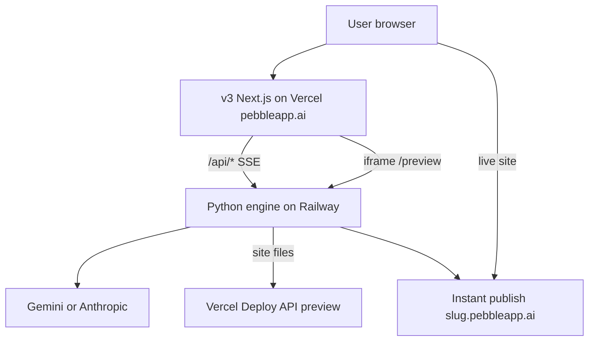

# Pebble architecture (handoff map)

## Runtime diagram

## Repository layout

| Path | Role |
|------|------|
| [`pebble_engine.py`](../pebble_engine.py) | HTTP server shell, `PebbleHandler`, `main()` — delegates to `pebble/server/` |
| [`pebble/server/router.py`](../pebble/server/router.py) | Route dispatch (`route_get`, `route_post`, …) |
| [`pebble/server/*.py`](../pebble/server/) | One module per API area (`run_*` handlers) |
| [`pebble/*.py`](../pebble/) | Domain logic (events, launchpad, publish, evals, repair) |
| [`pebble/evals/`](../pebble/evals/) | Post-build quality gate (anti-slop moat) |
| [`ui/v3/`](../ui/v3/) | Product frontend (proxies `/api` to engine) |
| [`tests/`](../tests/) | Pytest suite (~2600 tests) |
| [`scripts/verify_*.py`](../scripts/) | Production smoke scripts |
| [`scripts/verify_all.py`](../scripts/verify_all.py) | Full gate + `VERIFICATION_REPORT.md` |

## Add a feature (checklist)

1. **Route** — add branch in `pebble/server/router.py`
2. **Handler** — `pebble/server/<feature>.py` with `run_<feature>(handler, …)`
3. **Logic** — `pebble/<feature>.py` if more than a few lines
4. **Test** — `tests/test_<feature>.py`; public APIs also `tests/test_http_e2e.py`
5. **Prod smoke** — `scripts/verify_<feature>_prod.py` if user-visible on pebbleapp.ai
6. **Verify** — `python scripts/verify_all.py` → `VERIFICATION_REPORT.md` PASS
7. **Handoff** — `HANDOFF_*.md` from [HANDOFF_TEMPLATE.md](../HANDOFF_TEMPLATE.md)

## Rules for contributors

- **Do not** add business logic to `pebble_engine.py` — extract to `pebble/server/`
- **Do not** claim done without `VERIFICATION_REPORT.md` PASS ([docs/VERIFICATION.md](VERIFICATION.md))
- Generated sites live under `output/<slug>/site/` (filesystem; plan S3 later at scale)

## Key env vars

See [`.env.example`](../.env.example). Production: Railway (engine) + Vercel (v3) env dashboards.
